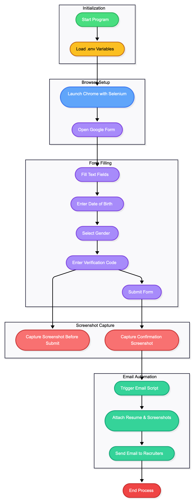

# Google Form Automation & Email Submission System

**Python Selenium & Flask Project | The Medius Assignment**

A production-ready system to automate Google Form submissions and send assignment emails programmatically, built with clean code, modular architecture, and professional documentation.

---

## Overview

This project demonstrates advanced web automation and backend integration:

* Automates Google Form filling and submission with dynamic field detection
* Captures confirmation screenshots for verification
* Sends automated emails with attachments via Flask API
* Designed for scalability, maintainability, and error resilience

**Key Outcomes:**

* Eliminates manual form submission
* Reduces human error in assignment submission
* Fully deployable and production-ready

---

## Features

**Form Automation**

* Automatic detection and filling of text, email, dropdown, radio, and checkbox fields
* Screenshot capture of the confirmation page
* Smart wait mechanisms for reliable execution
* Comprehensive error handling and logs
* Headless mode for background execution

**Email Automation**

* Flask-based REST API for sending emails programmatically
* Attachments support (screenshots, resumes, documents)
* Multiple recipients (To, CC) with secure authentication
* Professional email templates

---

## Flowchart Of Automation Process



## Technical Stack

| Technology        | Version | Role                     |
| ----------------- | ------- | ------------------------ |
| Python            | 3.8+    | Core scripting & backend |
| Selenium          | 4.15.2  | Form automation          |
| Flask             | 3.0.0   | Email service API        |
| WebDriver Manager | 4.0.1   | ChromeDriver management  |
| Chrome/Chromium   | Latest  | Browser automation       |

---

## Installation

### Prerequisites

* Python 3.8+
* Google Chrome
* Gmail with App Password enabled

### Steps

1. Clone the repository:

```bash
git clone https://github.com/yourusername/medius-assignment.git
cd medius-assignment
```

2. Create a virtual environment:

```bash
# macOS/Linux
python3 -m venv venv
source venv/bin/activate
# Windows
python -m venv venv
venv\Scripts\activate
```

3. Install dependencies:

```bash
pip install -r requirements.txt
```

4. Verify setup:

```bash
python form_automation.py --help
```

---

## Configuration

**Form Automation**
Update `form_automation.py`:

```python
form_data = {
    "name": "Your Name",
    "email": "your.email@example.com",
    "phone": "1234567890",
    "message": "Your message here"
}
```

**Email Service**
Update `email_service.py`:

```python
YOUR_EMAIL = "your.email@gmail.com"
YOUR_APP_PASSWORD = "your_16_char_app_password"
YOUR_NAME = "Your Name"
GITHUB_REPO = "https://github.com/yourusername/medius-assignment"
```

---

## Usage

**1. Run Automation Script**

```bash
python form_automation.py
python email_service.py
```

**2. Use Flask API**

```bash
python email_service.py
curl -X POST http://localhost:5000/send-assignment \
  -H "Content-Type: application/json" \
  -d '{
    "sender_email": "your.email@gmail.com",
    "sender_password": "your_app_password",
    "candidate_name": "Your Name",
    "screenshot_path": "screenshots/confirmation.png",
    "github_repo": "https://github.com/yourusername/medius-assignment",
    "resume_path": "documents/resume.pdf"
  }'
```

---

## Project Structure

```
medius-assignment/
├── form_automation.py      # Selenium automation
├── email_service.py        # Flask email API
├── requirements.txt        # Dependencies
├── README.md               # Project documentation
├── screenshots/            # Confirmation images
├── documents/              # Resume & portfolio
└── tests/                  # Optional unit tests
```

---

## Technical Approach

**Architecture:**

1. Form Automation Layer: Detects fields, fills data, submits, and captures screenshots
2. Email Automation Layer: Sends emails via Flask API with attachments
3. Error Handling: Logs exceptions and captures failure screenshots
4. Modular & Reusable: Each component can be reused or extended

**Design Highlights:**

* Dynamic element detection for diverse forms
* Explicit and implicit waits for reliability
* Security via Gmail App Passwords and environment variables

---

## Author

**Nikhil Singh**

* Email: [nikhilsingh652004@gmail.com](mailto:nikhilsingh652004@gmail.com)
* LinkedIn: [linkedin.com/in/nikhil-singh-b8b559237](https://www.linkedin.com/in/nikhil-singh-b8b559237/)
* GitHub: [github.com/tstnikhil4356](https://github.com/tstnikhil4356)

---

**This README is designed to highlight your technical skills, automation expertise, and production-readiness, making it appealing to recruiters and hiring managers.**
